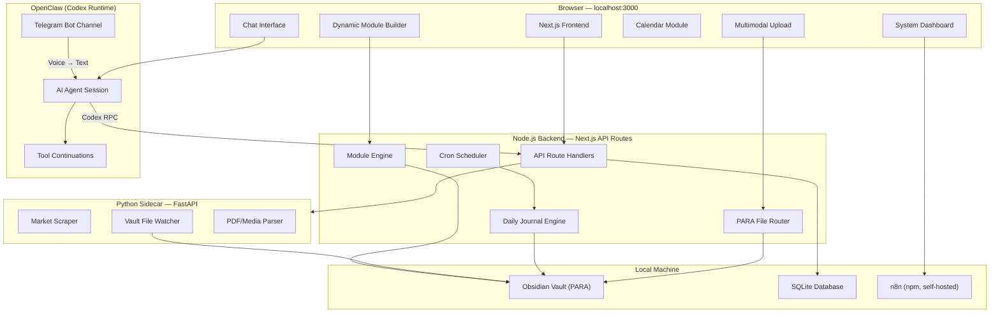

# VaultOS — Local-First AI Personal Operating System

A unified, multimodal web interface that serves as your personal command center — managing an Obsidian vault via the PARA method, routing files intelligently, tracking projects (Aqua Farm, Phone Business, Content), and maintaining persistent memory with anti-hallucination guardrails. Everything runs locally with ironclad privacy.

**AI Backend**: OpenClaw with Codex runtime harness
**Voice Input**: Telegram Bot (via OpenClaw channel integration)

---

## Resolved Design Decisions

| Question | Decision |
|:---|:---|
| **Obsidian Vault** | Brand-new PARA-structured vault, created at `VaultOS/vault/` |
| **AI Backend** | OpenClaw with Codex runtime — handles agent sessions, tool continuations, and state; VaultOS frontend communicates via OpenClaw's API/RPC |
| **n8n** | Self-hosted via npm (not Docker) — already running locally |
| **Domain Modules** | Dynamic — user defines modules from the UI, system soft-codes them into the vault structure and dashboard |
| **Voice Input** | No browser speech-to-text — OpenClaw handles voice via Telegram Bot channel; VaultOS receives transcribed text from OpenClaw |

---

## Architecture Overview



---

## Technology Stack

| Layer | Technology | Rationale |
|:---|:---|:---|
| **Frontend Framework** | Next.js 15 (App Router) | Server components, API routes, local development |
| **Styling** | Vanilla CSS with CSS custom properties | Full control, no framework dependency, dark mode support |
| **AI Backend** | OpenClaw (Codex runtime) | Model-agnostic agent framework, handles sessions + tools + Telegram |
| **Communication** | OpenClaw RPC / REST API | Frontend ↔ OpenClaw agent communication |
| **Local Database** | SQLite via `better-sqlite3` | Zero-config, file-based, perfect for local-first |
| **File Parsing** | `pdf-parse`, `sharp`, `fluent-ffmpeg` | PDF text extraction, image metadata, video thumbnails |
| **Markdown** | `remark` + `rehype` + `gray-matter` | Parse/render Obsidian-compatible markdown with frontmatter |
| **Python Sidecar** | FastAPI + `watchdog` | File watching, web scraping, heavy media processing |
| **Scheduling** | `node-cron` | Daily journal generation, morning briefs |
| **Automation** | n8n (npm self-hosted) | Webhook workflows, external integrations |
| **Voice Input** | Telegram Bot (via OpenClaw) | Voice notes transcribed and routed to VaultOS |
| **Font** | Inter (Google Fonts) | Clean, modern, highly readable |

---

## PARA Vault Structure

The vault will be created at `VaultOS/vault/` on first launch:

```
vault/
├── 01-Projects/
│   ├── aqua-farm/
│   │   ├── setup-logs/
│   │   ├── water-tests/
│   │   ├── breeding-cycles/
│   │   └── _project-board.md
│   ├── phone-business/
│   │   ├── market-research/
│   │   ├── deals/
│   │   ├── inventory/
│   │   └── _project-board.md
│   └── content-factory/
│       ├── youtube/
│       ├── facebook/
│       ├── instagram/
│       ├── scripts/
│       └── _project-board.md
├── 02-Areas/
│   ├── finance/
│   ├── health/
│   ├── learning/
│   └── relationships/
├── 03-Resources/
│   ├── legal-regulations/
│   ├── market-data/
│   ├── templates/
│   └── knowledge-base/
├── 04-Archives/
│   └── completed-projects/
├── _daily-journals/
│   ├── 2026-06-13.md
│   ├── 2026-06-12.md
│   └── ...
├── _system/
│   ├── config.md
│   ├── modules.json          ← dynamic module definitions
│   ├── morning-briefs/
│   └── automation-logs/
└── _media/
    ├── photos/
    ├── videos/
    └── documents/
```

---

## Proposed Changes

### Phase 1: Project Scaffolding & Core Infrastructure

#### [NEW] Project initialization
- Initialize Next.js 15 with App Router, TypeScript, ESLint
- Set up the project in `/Users/swapnilshrestha/Development/AI Projects/VaultOS`
- Configure `next.config.ts` for local development
- Set up environment variables structure (`.env.local`)

#### [NEW] package.json
Core dependencies:
```
better-sqlite3, gray-matter, remark, rehype,
pdf-parse, sharp, node-cron, socket.io, marked
```

#### [NEW] src/lib/db.ts
SQLite database initialization with tables:
- `conversations` — chat history with timestamps
- `messages` — individual messages with role, content, attachments
- `tasks` — task tracking with status, due dates, project linkage
- `daily_journals` — journal entries indexed by date
- `file_routes` — log of every file routed by the PARA engine
- `system_events` — dashboard event log
- `modules` — dynamic module definitions (name, icon, color, subfolder structure)

#### [NEW] src/lib/vault.ts
Obsidian vault interface:
- `readMarkdownFile(path)` — read + parse frontmatter
- `writeMarkdownFile(path, content, frontmatter)` — write Obsidian-compatible MD
- `listDirectory(path)` — traverse vault directories
- `scaffoldPARA()` — create PARA structure if missing
- `searchVault(query)` — full-text search across vault files
- `getRecentFiles(n)` — last N modified files for context

#### [NEW] src/lib/config.ts
Configuration management:
- Vault path (default: `./vault/`)
- OpenClaw endpoint URL + auth
- n8n endpoint URL (npm self-hosted)
- Active dynamic modules
- User preferences (name: "Luccy", timezone: Asia/Kathmandu)

---

### Phase 2: Unified Multimodal Web UI

#### [NEW] src/app/layout.tsx
Root layout with:
- Global CSS import
- Inter font from Google Fonts
- Dark theme by default with light mode toggle
- SEO meta tags
- WebSocket provider for real-time dashboard updates

#### [NEW] src/app/globals.css
Design system with CSS custom properties:
- **Color palette**: Deep slate backgrounds (`hsl(222, 47%, 6%)`), electric accent blues, warm amber highlights, semantic status colors
- **Typography**: Inter font stack, fluid type scale
- **Spacing**: 4px base grid system
- **Glassmorphism**: `backdrop-filter: blur()` panels with semi-transparent borders
- **Animations**: Subtle fade-ins, slide-ups, pulse indicators, skeleton loaders
- **Components**: Chat bubbles, cards, modals, sidebar, calendar cells, status badges

#### [NEW] src/app/page.tsx
Main application shell — a 3-panel layout:
- **Left sidebar** (collapsible): Navigation, dynamic project modules, quick actions
- **Center panel**: Chat interface (primary view) or Calendar (switchable)
- **Right panel** (collapsible): System dashboard, active tasks, recent files

#### [NEW] src/components/chat/ChatInterface.tsx
Core chat component:
- Message thread with streaming responses from OpenClaw
- User messages with rich formatting
- AI responses with markdown rendering
- Typing indicator with animated dots
- Message timestamp display
- Conversation history sidebar
- Indicator when messages arrive from Telegram channel

#### [NEW] src/components/chat/MessageBubble.tsx
Individual message rendering:
- User vs. AI styling differentiation
- Markdown rendering with syntax highlighting
- Embedded image/video previews for attachments
- Copy-to-clipboard action
- "Route to vault" action button on AI responses
- Source channel badge (Web / Telegram)

#### [NEW] src/components/upload/UniversalUpload.tsx
Multimodal upload widget:
- Drag-and-drop zone with file type icons
- Accept: `.txt`, `.md`, `.pdf`, `.jpg/.png/.webp`, `.mp4/.mov`
- Upload progress bar with animated gradient
- Preview thumbnail generation
- Auto-trigger PARA routing on successful upload
- Paste-from-clipboard support

#### [NEW] src/components/dashboard/SystemDashboard.tsx
Real-time system dashboard:
- **Active Automations**: List of running n8n workflows with status badges
- **Recent File Routes**: Last 10 files processed by PARA router with category tags
- **System Health**: OpenClaw connection status, vault sync status, DB size, n8n status
- **Event Feed**: Live-updating log of system events
- WebSocket-driven updates (no polling)

---

### Phase 3: OpenClaw Integration & AI Communication

#### [NEW] src/lib/openclaw-client.ts
OpenClaw client interface:
- Connect to local OpenClaw agent via RPC/REST
- Configure Codex runtime as `agentRuntime.id: "codex"`
- Send messages with context payload
- Receive streamed responses
- Handle tool continuations (OpenClaw manages these natively)
- Session management (start/resume/end)

#### [NEW] src/app/api/chat/route.ts
Chat API route (bridge between frontend and OpenClaw):
- Receives user message + optional file attachments
- Builds context payload for OpenClaw:
  1. Today's daily journal (anti-hallucination ground truth)
  2. Recent conversation history (last 20 messages from SQLite)
  3. Relevant vault files found via search (RAG-lite)
  4. Active project/module summaries
- Forwards to OpenClaw agent session
- Streams response back to frontend via SSE
- Logs message + response to SQLite after stream completes

#### [NEW] src/lib/context-builder.ts
Anti-hallucination context assembly:
- `buildContextPayload()` — current date, user name, active modules
- `getTodayJournal()` — reads today's `_daily-journals/YYYY-MM-DD.md`
- `getRelevantContext(query)` — searches vault for query-relevant files
- `getActiveModules()` — reads `_project-board.md` from each active module
- `truncateToTokenLimit(context, maxTokens)` — ensures we never exceed limits
- **Privacy guard**: Only sends assembled context string, never raw file paths or full vault

#### [NEW] src/app/api/telegram-webhook/route.ts
Telegram → VaultOS bridge:
- Receives transcribed messages from OpenClaw's Telegram Bot channel
- Routes voice-originated messages into the same conversation thread
- Tags messages with `source: "telegram"` in SQLite
- Triggers PARA routing if the message contains file/context descriptions

---

### Phase 4: Intelligent File Routing & PARA Engine

#### [NEW] src/app/api/upload/route.ts
File upload endpoint:
- Accept multipart form data
- Save raw file to `_media/` subfolder (photos/, videos/, documents/)
- Extract content: text from PDFs, EXIF from images, metadata from videos
- Pass extracted content to PARA classifier (via OpenClaw)
- Return routing result to frontend

#### [NEW] src/lib/para-router.ts
Intelligent PARA classification engine:
- Sends file content/description to OpenClaw with structured output prompt
- Agent returns JSON: `{ category: "Projects", subfolder: "aqua-farm/setup-logs", title: "New Rotala Setup", tags: ["plants", "crate-3"] }`
- Creates structured markdown file with frontmatter:
  ```markdown
  ---
  title: "New Rotala HRa Setup - Crate 3"
  date: 2026-06-13
  category: Projects
  project: aqua-farm
  tags: [plants, rotala, crate-3]
  media: ["_media/photos/2026-06-13_rotala.jpg"]
  ---
  
  ## Setup Log
  Added new Rotala HRa to crate 3. [Photo attached]
  
  ![[2026-06-13_rotala.jpg]]
  ```
- Saves to correct PARA folder
- Logs route decision to SQLite `file_routes` table
- Emits event to dashboard via WebSocket

#### [NEW] src/lib/file-parsers.ts
Content extraction utilities:
- `parsePDF(buffer)` — extract text using `pdf-parse`
- `parseImage(buffer)` — extract EXIF, generate thumbnail via `sharp`
- `parseVideo(path)` — extract metadata, generate poster frame via `ffmpeg`
- `parseText(content)` — pass-through with encoding detection

---

### Phase 5: Calendar, Tasks & Daily Journal

#### [NEW] src/components/calendar/CalendarView.tsx
Visual calendar module:
- Month view with day cells showing activity indicators
- Week view with time blocks
- Day view with full detail: tasks, logs, journal entries
- Color-coded by dynamic module (user-assigned colors)
- Click any day → loads that day's journal + tasks
- Future dates show scheduled milestones
- Smooth view transition animations between month/week/day

#### [NEW] src/components/calendar/DayDetail.tsx
Day detail panel:
- Morning brief summary
- Task checklist with completion toggles
- Journal entry preview
- Media uploads from that day (photo/video thumbnails)
- "What happened" narrative from the AI journal

#### [NEW] src/app/api/calendar/route.ts
Calendar data API:
- Reads `_daily-journals/` folder for date-indexed entries
- Queries SQLite `tasks` table for date ranges
- Aggregates module milestone data from `_project-board.md` files
- Returns structured calendar data

#### [NEW] src/lib/daily-journal.ts
Daily journal engine (runs via `node-cron` at 23:55 daily):
- Collects all of today's:
  - Chat messages (web + Telegram) from SQLite
  - Files routed by PARA engine
  - Tasks created/completed
  - System events
- Sends summary to OpenClaw: "Summarize today's activities for Luccy"
- Generates structured markdown:
  ```markdown
  ---
  title: "Daily Journal — June 13, 2026"
  date: 2026-06-13
  type: daily-journal
  ---
  
  ## Summary
  Today focused on aqua farm maintenance and content planning...
  
  ## Tasks Completed
  - [x] Water change on Tub 4
  - [x] Drafted YouTube script for phone review
  
  ## Tasks Created
  - [ ] Review partner deal terms (due: June 15)
  
  ## Files Processed
  - Routed 3 photos to Projects/aqua-farm/setup-logs
  - Saved market research PDF to Resources/market-data
  
  ## Key Decisions
  - Decided to scale Rotala production to 5 crates
  
  ## Tomorrow's Focus
  - Check emerged plant crates
  - Finalize YouTube video script
  - Review profit-sharing terms
  ```
- Saves to `_daily-journals/2026-06-13.md`

#### [NEW] src/lib/morning-brief.ts
Morning brief generator (runs via `node-cron` at 06:00 daily):
- Reads yesterday's journal
- Reads overdue + today's tasks
- Reads module board statuses
- Generates brief:
  ```
  Good morning, Luccy. Here is today's focus:
  • Aqua Farm: Check the emerged plant crates (scheduled from 2 days ago)
  • Content: Finalize the script for the next YouTube video
  • Business: Review the profit-sharing terms for the upcoming partner deal
  ```
- Saves to `_system/morning-briefs/`
- Displays as a dismissible banner in the UI on first load

---

### Phase 6: Dynamic Module System (Soft-Coded)

#### [NEW] src/components/modules/ModuleBuilder.tsx
UI-driven module creator:
- "Create New Module" wizard accessible from sidebar
- Fields: Module name, icon (emoji picker), accent color, description
- Subfolder template selector (or custom folder structure)
- Auto-generates:
  - Vault folder under `01-Projects/{module-slug}/`
  - `_project-board.md` with template
  - Module config entry in `_system/modules.json`
  - SQLite `modules` table entry
- Edit/archive existing modules from the same UI

#### [NEW] src/components/modules/ModuleRenderer.tsx
Dynamic module view renderer:
- Reads module config from `_system/modules.json`
- Renders the four-quadrant project board: Done / Active / Todo / Future
- Populates data from vault markdown files in the module's folder
- Supports module-specific views:
  - **Photo gallery** — if module has `_media/` subfolder
  - **Deal tracker** — if module has `deals/` subfolder
  - **Content pipeline** — if module has `scripts/` subfolder
- All views are data-driven, not hard-coded

#### [NEW] src/components/modules/ProjectBoard.tsx
Reusable project board component (used by all dynamic modules):
- Four-quadrant layout: Done / Active / Todo / Future
- Task cards with drag-and-drop reordering
- Progress bar per quadrant
- Filter by tag, date range, priority
- All data sourced from vault markdown files
- Module accent color theming

#### [NEW] src/lib/module-engine.ts
Module lifecycle manager:
- `createModule(config)` — scaffold vault folders + register module
- `updateModule(id, config)` — update config, rename folders if needed
- `archiveModule(id)` — move to `04-Archives/`, mark inactive
- `getActiveModules()` — list all registered modules
- `getModuleData(id)` — read all vault files for a module
- Pre-seeded with 3 starter modules: Aqua Farm, Phone Business, Content Factory

#### [NEW] vault/_system/modules.json
Dynamic module registry:
```json
{
  "modules": [
    {
      "id": "aqua-farm",
      "name": "Aqua Farm",
      "icon": "🐟",
      "color": "#14b8a6",
      "description": "Aquatic plant farming & fish breeding",
      "subfolders": ["setup-logs", "water-tests", "breeding-cycles"],
      "features": ["photo-gallery", "alerts"],
      "createdAt": "2026-06-13",
      "status": "active"
    },
    {
      "id": "phone-business",
      "name": "Phone Business",
      "icon": "📱",
      "color": "#f59e0b",
      "description": "Smartphone trading & market research",
      "subfolders": ["market-research", "deals", "inventory"],
      "features": ["deal-tracker", "market-data"],
      "createdAt": "2026-06-13",
      "status": "active"
    },
    {
      "id": "content-factory",
      "name": "Content Factory",
      "icon": "🎬",
      "color": "#a855f7",
      "description": "YouTube, Facebook, Instagram content pipeline",
      "subfolders": ["youtube", "facebook", "instagram", "scripts"],
      "features": ["content-pipeline", "calendar-overlay"],
      "createdAt": "2026-06-13",
      "status": "active"
    }
  ]
}
```

---

### Phase 7: Automation & n8n Integration

#### [NEW] src/components/automation/AutomationPanel.tsx
n8n integration panel:
- Embedded n8n workflow viewer (iframe pointing to local npm instance)
- Webhook trigger buttons for common workflows
- Workflow status indicators (running, completed, failed)
- Log viewer for recent webhook executions

#### [NEW] src/app/api/automation/route.ts
Automation API bridge:
- Proxy requests to local n8n instance (npm self-hosted)
- Trigger workflows via n8n REST API
- Fetch workflow execution statuses
- Register VaultOS-specific webhooks (e.g., "on file routed", "on journal generated")

---

### Phase 8: Python Sidecar (Market Scraping & File Watching)

#### [NEW] sidecar/main.py
FastAPI server (port 8001):
- `/scrape/market` — scrape local marketplace data (Hamrobazar, etc.)
- `/scrape/trends` — fetch trending smartphone models
- `/watch/start` — start vault file watcher via `watchdog`
- `/watch/events` — SSE stream of vault filesystem changes
- `/parse/pdf` — heavy PDF parsing with OCR fallback
- `/parse/media` — video transcoding, image processing

#### [NEW] sidecar/requirements.txt
```
fastapi
uvicorn
watchdog
beautifulsoup4
httpx
pillow
```

#### [NEW] sidecar/scraper.py
Market scraping module:
- Configurable target URLs
- Rate-limited requests
- Data normalization to JSON
- Results saved to `03-Resources/market-data/` in vault

---

## Privacy Architecture

```mermaid
graph LR
    subgraph Local["YOUR MACHINE (Everything Stays Here)"]
        Vault["Obsidian Vault"]
        DB["SQLite DB"]
        Media["Photos/Videos"]
        N8N["n8n (npm)"]
        App["VaultOS App"]
        OC["OpenClaw Agent"]
    end

    subgraph Cloud["CLOUD (Minimal, Ephemeral)"]
        API["LLM API (via Codex)"]
    end

    App -->|"context payload only"| OC
    OC -->|"Only sends: context snippet +\nquery (no files, no paths)"| API
    API -->|"Returns: text response only"| OC

    style Local fill:#0d1117,stroke:#30a14e,stroke-width:3px
    style Cloud fill:#0d1117,stroke:#f85149,stroke-width:2px,stroke-dasharray:5
```



**Privacy guarantees implemented in code:**
1. Context builder strips all absolute file paths before sending to OpenClaw/API
2. Images are described locally; raw media never leaves the machine unless explicitly approved
3. API responses are never cached on cloud — only stored locally in SQLite
4. No telemetry, no analytics, no external network calls except via OpenClaw to LLM API
5. n8n runs entirely locally (npm self-hosted)
6. Telegram Bot voice notes are transcribed by OpenClaw locally before context is sent

---

## File Structure Overview

```
VaultOS/
├── src/
│   ├── app/
│   │   ├── layout.tsx
│   │   ├── page.tsx
│   │   ├── globals.css
│   │   └── api/
│   │       ├── chat/route.ts
│   │       ├── upload/route.ts
│   │       ├── calendar/route.ts
│   │       ├── tasks/route.ts
│   │       ├── vault/route.ts
│   │       ├── automation/route.ts
│   │       ├── journal/route.ts
│   │       ├── modules/route.ts
│   │       └── telegram-webhook/route.ts
│   ├── components/
│   │   ├── chat/
│   │   │   ├── ChatInterface.tsx
│   │   │   ├── MessageBubble.tsx
│   │   │   └── ConversationList.tsx
│   │   ├── upload/
│   │   │   └── UniversalUpload.tsx
│   │   ├── dashboard/
│   │   │   ├── SystemDashboard.tsx
│   │   │   ├── EventFeed.tsx
│   │   │   └── HealthIndicator.tsx
│   │   ├── calendar/
│   │   │   ├── CalendarView.tsx
│   │   │   ├── DayDetail.tsx
│   │   │   └── MorningBrief.tsx
│   │   ├── modules/
│   │   │   ├── ModuleBuilder.tsx
│   │   │   ├── ModuleRenderer.tsx
│   │   │   └── ProjectBoard.tsx
│   │   ├── automation/
│   │   │   └── AutomationPanel.tsx
│   │   └── ui/
│   │       ├── Sidebar.tsx
│   │       ├── Modal.tsx
│   │       ├── StatusBadge.tsx
│   │       └── ThemeToggle.tsx
│   └── lib/
│       ├── db.ts
│       ├── vault.ts
│       ├── config.ts
│       ├── openclaw-client.ts
│       ├── context-builder.ts
│       ├── para-router.ts
│       ├── file-parsers.ts
│       ├── daily-journal.ts
│       ├── morning-brief.ts
│       ├── module-engine.ts
│       └── websocket.ts
├── vault/                        ← brand-new PARA vault (created on first launch)
│   ├── 01-Projects/
│   ├── 02-Areas/
│   ├── 03-Resources/
│   ├── 04-Archives/
│   ├── _daily-journals/
│   ├── _system/
│   └── _media/
├── sidecar/
│   ├── main.py
│   ├── scraper.py
│   ├── watcher.py
│   └── requirements.txt
├── public/
│   └── icons/
├── Implementation Plan.md       ← this file
├── package.json
├── tsconfig.json
├── next.config.ts
├── .env.local
└── README.md
```

---

## Verification Plan

### Automated Tests
```bash
# TypeScript type checking
npx tsc --noEmit

# Lint check
npx next lint

# Build verification
npm run build
```

### Manual Verification
1. **Chat Flow**: Send a text message → verify OpenClaw receives context → verify streaming response → verify message persisted in SQLite
2. **File Upload**: Upload a photo → verify PARA classification via OpenClaw → verify markdown file created in correct vault folder
3. **Dynamic Modules**: Create a new module from UI → verify vault folders scaffolded → verify module appears in sidebar
4. **Calendar**: Verify daily journal entries appear on correct calendar dates
5. **Morning Brief**: Trigger brief generation → verify it displays as banner in UI
6. **Dashboard**: Upload a file → verify real-time event appears in dashboard feed
7. **Privacy**: Inspect network tab → verify only OpenClaw/LLM API calls leave localhost
8. **Telegram**: Send voice note via Telegram → verify transcribed text arrives in VaultOS chat
9. **n8n**: Trigger a webhook → verify automation status appears in dashboard

### Development Milestones

| Phase | Milestone | Description |
|:---|:---|:---|
| 1 | Project scaffold + DB + vault interface | Foundation infrastructure |
| 2 | Chat UI + Upload + Dashboard shell | Core UI with 3-panel layout |
| 3 | OpenClaw integration + context builder | AI engine with anti-hallucination |
| 4 | PARA router + file parsing | Intelligent file classification |
| 5 | Calendar + daily journal + morning brief | Memory & scheduling system |
| 6 | Dynamic module system (soft-coded) | UI-defined project modules |
| 7 | n8n integration + automation panel | Webhook workflows |
| 8 | Python sidecar (scraping + file watching) | Market data & vault monitoring |
