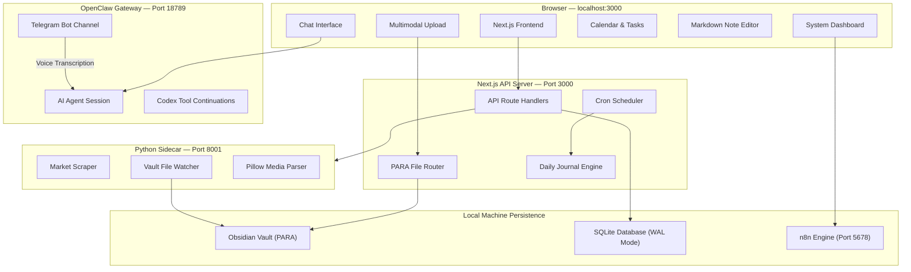

# 🪐 VaultOS — Local-First AI Personal Operating System

VaultOS is a premium, local-first command center and personal operating system designed to run entirely on your local machine with absolute privacy. It orchestrates a local Obsidian vault under the **PARA Method** (Projects, Areas, Resources, Archives), processes multimodal file uploads, manages dynamic sub-modules, integrates with self-hosted **n8n** automation workflows, and runs a **Python FastAPI sidecar** for file-watching and local marketplace scraping.

---

## ⚡ Key Features

*   **Unified Multimodal Web UI**: Sleek, glassmorphic dark theme featuring double-drawer auto-expanding sidebars on hover. Slide-out explorer for files and system logs avoids workspace reflow jitters.
*   **Intelligent PARA File Router**: Parses text, PDF documents, and image metadata locally, using **OpenClaw (Codex)** to automatically classify and route files to correct Obsidian folder paths.
*   **Active PARA Notes Explorer**: Create, edit, rename/move (across categories), and delete Obsidian notes directly from the left sidebar with a rich markdown and frontmatter editor.
*   **Visual Calendar & Task Management**: Interactive event calendar and dynamic task boards synced directly from your vault's markdown logs.
*   **Dynamic Domain Module Builder**: Soft-code custom project modules (e.g., Aqua Farm, Phone Business, Content Factory) directly from the UI into `/vault/_system/modules.json`.
*   **n8n Automation Panel**: Directly monitors and triggers self-hosted local n8n workflows through an integrated API bridge.
*   **Python FastAPI Sidecar**: Watches the vault recursively using `watchdog` to stream filesystem events (SSE) to the UI, and scrapes local Nepalese marketplace listings (Hamrobazar) for phones trading inventory.
*   **Unified Multi-Process Runner**: Starts all dependencies (Next.js, Python Sidecar, n8n, OpenClaw) with a single command and unified, color-coded logging.

---

## 🏗️ Architecture Overview



---

## 🛠️ Installation & Setup

### Prerequisites
1.  **Node.js** (v18 or higher)
2.  **Python 3.9+**
3.  **n8n** (installed globally via npm)
4.  **OpenClaw** (configured and running locally on port `18789`)

### 1. Configure Environment Variables
Create a `.env.local` file in the project root:
```env
VAULT_PATH=/Users/swapnilshrestha/Development/AI Projects/VaultOS/vault
USER_NAME=Luccy
TIMEZONE=Asia/Kathmandu
OPENCLAW_API_URL=http://127.0.0.1:18789
N8N_API_URL=http://127.0.0.1:5678
```

### 2. Setup Python Virtual Environment
Initialize and install the FastAPI sidecar dependencies:
```bash
python3 -m venv sidecar/.venv
./sidecar/.venv/bin/pip install -r sidecar/requirements.txt
```

---

## 🚀 Running the App

VaultOS includes a smart process runner (`dev-runner.js`) that automatically checks ports and launches all services concurrently with color-coded logging.

```bash
# Install NPM dependencies
npm install

# Start the entire VaultOS ecosystem
npm run dev
```

The runner handles:
*   Checking if **OpenClaw** is running as a macOS LaunchAgent (skips duplicate boot if port `18789` is bound).
*   Checking if **n8n** is already running (skips if port `5678` is bound; boots otherwise).
*   Booting the **Python Sidecar** on port `8001`.
*   Booting the **Next.js Turbopack** dev server on port `3000`.

*Press `Ctrl + C` in your terminal to trigger a clean graceful shutdown of all background services.*

---

## 📂 Vault Directory Layout

VaultOS structures your Obsidian vault under the PARA structure inside `vault/` on first startup:
```
vault/
├── 01-Projects/              # Active projects (Aqua Farm, Phone Business, etc.)
├── 02-Areas/                 # Long-term responsibilities (Finance, Health, etc.)
├── 03-Resources/             # Topics of interest (Market Data, Templates, etc.)
├── 04-Archives/              # Inactive/completed items
├── _daily-journals/          # Automated daily reviews & morning briefs
├── _system/                  # Dynamic modules.json configuration
└── _media/                   # Processed media folders (photos, videos, documents)
```

---

## 🔍 Diagnostics & Troubleshooting

*   **Next.js Frontend**: Accessible on `http://localhost:3000`
*   **FastAPI Sidecar Health**: Verify via `http://127.0.0.1:8001/health`
*   **n8n Dashboard**: Accessible on `http://localhost:5678`
*   **SQLite Concurrency**: Database locks are avoided by utilizing `better-sqlite3` in WAL (Write-Ahead Logging) mode with a default busy timeout of `10000ms`.
